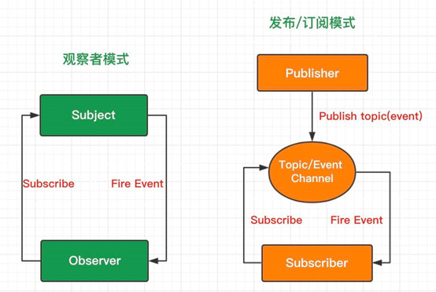

### 发布-订阅模式
- 观察者模式：观察者（Observer）直接订阅（Subscribe）主题（Subject），而当主题被激活的时候，会触发（Fire Event）观察者里的事件。
- 发布-订阅模式：订阅者（Subscriber）把自己想订阅的事件注册（Subscribe）到调度中心（Topic），当发布者（Publisher）发布该事件（Publish topic）到调度中心，也就是该事件触发时，由调度中心统一调度（Fire Event）订阅者注册到调度中心的处理代码。



```
class TaskLine {
    constructor (opt) {
        this.name = opt && opt.name || '';
        this.info = opt && opt.info || '';
        this.eventList = [];
    }
    subscribe(target, fn) {
        const { name } = this;
        if (target.name === name) {
            throw new Error('Can not subscribe self');
        }
        if (target.eventList.indexOf(fn) == -1) {
            target.eventList.push(fn);
        }
    }
    publish(n) {
        this.eventList.forEach(list => list(n));
    }
}
const taskLine1 = new TaskLine({
    name: 'task1',
    info: 1
})
const taskLine2 = new TaskLine({
    name: 'task2',
    info: 2
})
const taskLine3 = new TaskLine({
    name: 'task3',
    info: 3
})
taskLine1.subscribe(taskLine1, (n) => {
    console.log(`TaskLine1 help taskLine1 go`);
}) // can not subscribe self;
taskLine1.subscribe(taskLine2, (n) => {
    console.log(`TaskLine1 help taskLine2 go`);
})
taskLine1.subscribe(taskLine3, (n) => {
    console.log(`TaskLine1 help taskLine3 go`);
})
taskLine2.subscribe(taskLine3, (n) => {
    if (n > 1000) {
        console.log(`TaskLine2 help taskLine3 go`);
    } else {
        console.log(`TaskLine2: I'm busy`);
    }
})
taskLine3.publish(1000);
```